<h1 style="text-align:center">웹프로그래밍 프로젝트 보고서</h1>

## 1. 프로젝트 정보
* **과제명:** To-Do List 업그레이드 (Version 3 → Version 4)
* **제출자:** 정이량(2022 2017), 황왕석(2022 2161)
* **제출일:** 2025년 06월 23일
* [**GitHub 원격 저장소**]()

>**simple_todos_v4.json 파일도 첨부**
**(프로젝트에서 파일 확인하실 때 기능 확인이 용이함)**


## 2. 서론

* **프로젝트 목표:** 본 보고서는 기본 To-Do List (GET, POST 기능만 포함된 V3)를 시작으로, 할 일 수정, 필터링, 정렬, 검색, 기한 설정, 유효성 검사, 에러 처리 UI 등 다양한 고급 기능을 추가하여 To-Do List (V4)를 구현한 과정과 결과를 설명합니다.
* **주요 변경 사항 요약:** 
    V4에서는 다음과 같은 주요 기술적 변화와 기능 향상이 이루어졌습니다:

    RESTful API 확장: 기존 GET, POST뿐 아니라 PUT, PATCH, DELETE 메서드를 도입하여 서버와의 통신이 더 명확하고 역할에 따라 분리된 구조로 설계되었습니다.

    클라이언트 측 로직 강화: 단순한 목록 표시에서 벗어나 DOM 조작을 통한 인터랙티브한 UI 구현, 필터링 및 정렬 알고리즘, 기한 비교 및 시각화 처리, 입력 유효성 검사 및 오류 처리 등의 기능을 자바스크립트를 통해 구현하였습니다.

    UI/UX 개선: 테이블/카드 뷰 전환, 마감일 기준 강조, 수정 입력창의 UX 개선 등 사용성 중심의 개발이 이루어졌습니다.

    또한 등록뿐 아니라 수정, 삭제, 필터링, 정렬, 검색, 기한 설정 등 다양한 고급 기능을 추가하였습니다
---

## 3. 구현 기능 목록 및 스크린샷

* **할 일 CRUD 기능:**
    * 할 일 조회 (GET)
        .png)
    * 할 일 추가 (POST)
        .png)
        .png)
    * **할 일 수정 (PUT):** 텍스트 및 기한 수정
        .png)
        .png)
    * **할 일 완료 상태 토글 (PATCH):** 체크박스
        .png)
        .png)
    * 할 일 삭제 (DELETE)
        .png)
        .png)
        .png)
---
* **할 일 필터링:** (예: 전체, 완료됨, 미완료됨)
        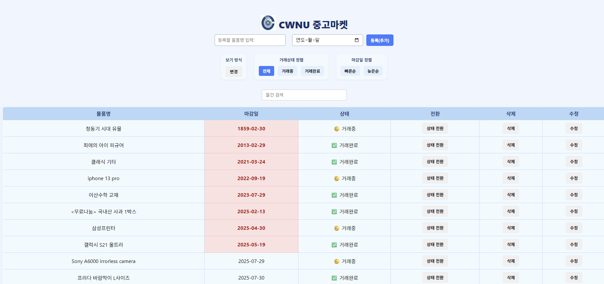
        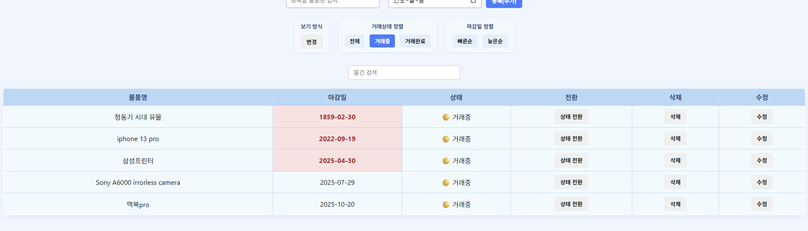
        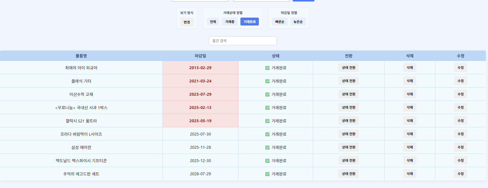
---
* **할 일 정렬:** (최신순, 오래된순)
        .png)
        .png)
---
* **간단한 검색 기능:**
        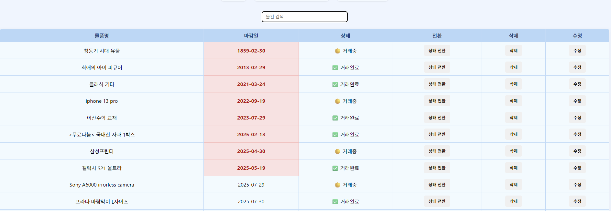
        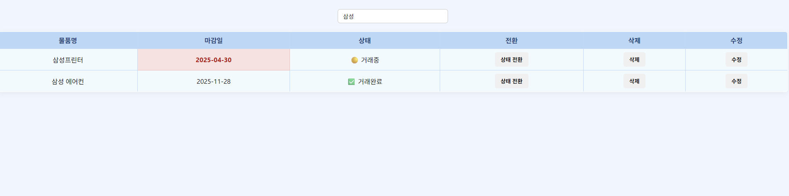
---
* **기한 설정 및 시각화:**
    * 할 일 추가/수정 시 기한 설정
        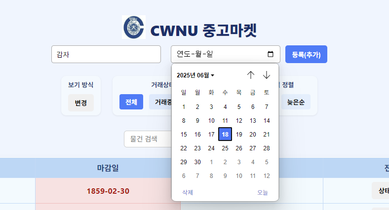
        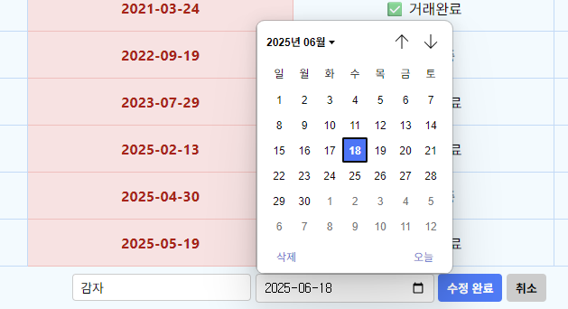
    * 기한 초과 할 일 시각적 강조
        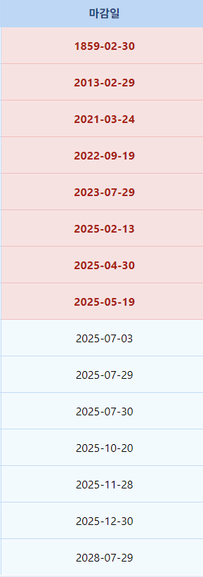
---
* **유효성 검사:** (클라이언트/서버)
        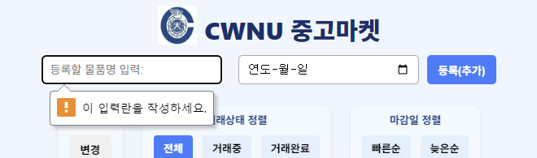
        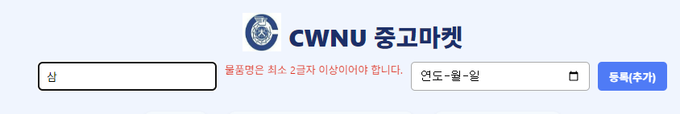
        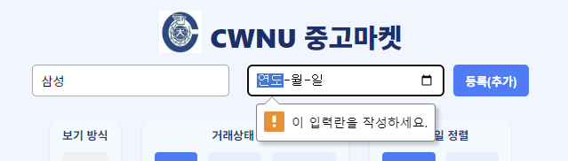
---
* **에러 처리 UI:** (서버 통신 실패 시 메시지 표시)
        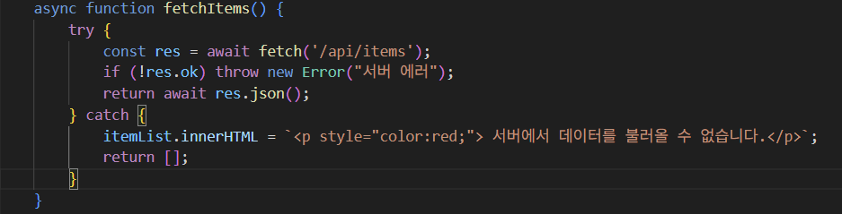
        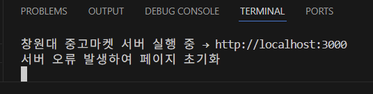
---
* **보기방식 변경 요소 추가:** (클릭 시 테이블 형식->카드 형식)
        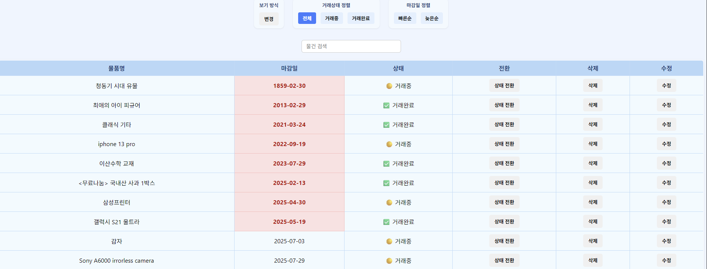
        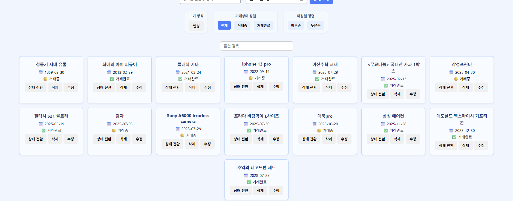
        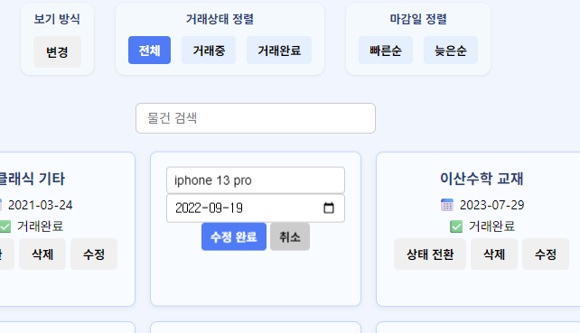
---
## 4. 주요 구현 내용 및 기술적 설명

각 기능별로 어떤 기술을 사용했고, 어떻게 구현했는지 상세히 설명합니다. 특히 **왜 그렇게 구현했는지** 를 명확히 밝힙니다.

### 4.1 API 디자인 (RESTful 원칙)
- V4에서는 RESTful 원칙에 따라 클라이언트와 서버 간의 역할을 명확히 분리하고, HTTP 메서드를 기능에 맞게 사용하여 API를 설계했습니다. 특히 PUT, PATCH, DELETE를 새롭게 도입하여 할 일 관리 시스템의 표현력과 유지보수성를 향상.

* **V3와 V4의 API 변화:** `PUT`, `PATCH`, `DELETE` 메서드를 도입하여 RESTful API를 어떻게 확장했는지 설명합니다.
    * `PATCH /api/items/:id` – 거래 상태 전환
       - 역할: isSold 상태(true ↔ false)를 토글하는 기능
       - HTTP 메서드 선택 이유: PATCH는 리소스의 일부 속성만 변경할 때 사용하는 메서드입니다. isSold만 바뀌기 때문에 PATCH가 적합합니다.
      -  요청 본문(body): 없음 (id만 URL에 포함)

    * `PUT /api/items/:id` – 항목 전체 수정
       - 역할: 제목(title)과 마감일(deadline)을 완전히 새 값으로 덮어씀
       - HTTP 메서드 선택 이유: PUT은 리소스를 전체적으로 교체할 때 사용합니다. 기존 데이터를 기반으로 부분 수정이 아니라 새로운 값으로 덮어쓰는 목적이므로 PUT을 채택했습니다.
       - 요청 본문(body): { "title": "새로운 제목", "deadline": "2025-06-30"}

    * `DELETE /api/items/:id`: `DELETE` – 항목 삭제
       - 역할: 지정된 id의 항목을 영구 삭제
       - HTTP 메서드 선택 이유: DELETE는 리소스를 제거할 때 사용하는 표준 메서드입니다. 명확하게 삭제의 의미를 전달할 수 있고, 서버 설계도 단순해집니다.
       - 요청 본문(body): 없음


    **URL 쿼리 파라미터 사용:** 
      
 - 본 프로젝트에서는 /api/items 하나만으로 서버에서 전체 데이터를 내려받고, 필터링,정렬,검색 기능은 모두 클라이언트 측에서 자바스크립트를 통해 처리하였습니다.

    - 즉, URL의 쿼리 파라미터를 서버 API에 전달하여 서버에서 조건에 맞는 데이터를 필터링하거나 정렬하는 방식은 도입하지 않았으며, 모든 데이터 처리 로직은 클라이언트에 집중되어 있습니다.
---

### 4.2 클라이언트 측 로직 구현 (/script.js)

* **할 일 수정 기능 (`PUT` 요청 관련):**
    
  - 사용자가 목록의 "수정" 버튼을 클릭하면, 해당 항목의 내용이 텍스트에서 입력 필드`<input>` 형태로 변경되며 인라인 폼 UI가 렌더링된다.
    카드 뷰에서는 해당 카드 내용이 사라지고 입력창과 저장/취소 버튼이 나타남.
    테이블 뷰에서는 `<tr>`을 새로운 행으로 대체하여 수정 폼을 표시.

   - 사용자가 "수정 완료" 버튼을 클릭하면 다음과 같은 PUT 요청이 발생:
      
     ```javascript
         <!-- await fetch(`/api/items/${item.id}`, {
            method: 'PUT',
            headers: { 'Content-Type': 'application/json' },
            body: JSON.stringify({ title: newTitle, deadline: newDeadline })
        }); -->
    ```
       
- 본문에는 사용자가 수정한 물품명과 마감일이 포함되어 있으며, 서버는 이를 해당 ID에 대응되는 항목에 반영.
 - 사용자가 "취소" 버튼을 클릭하면, 추가된 폼 요소를 제거하고 loadAndRender() 함수를 호출하여 기존 목록 뷰를 다시 복원.

---

* **할 일 필터링 기능:**
     
  - 사용자가 전체, 거래중, 거래완료 버튼 중 하나를 클릭하면, 해당 버튼의 data-filter 속성을 읽어 전역 상태 변수인 currentFilter에 저장:

    ```javascript
     <!-- btn.addEventListener("click", () => {
     currentFilter = btn.dataset.filter;
     loadAndRender();}); -->
    ```

  - 이후 loadAndRender() → applyFilter() 함수에서 아래 로직에 따라 클라이언트 측에서 항목을 필터링:

     ```javascript
    <!-- function applyFilter(items) {
    if (currentFilter === 'sold') return items.filter(i => i.isSold);
    if (currentFilter === 'unsold') return items.filter(i => !i.isSold);
    return items;} -->
    ```
---

* **할 일 정렬 기능:**
    
    - 사용자가 빠른순 또는 늦은순 버튼을 클릭하면 data-sort 값을 currentSort에 저장하고, 이후 loadAndRender()에서 정렬 로직 실행

    ```javascript
    <!-- items.sort((a, b) => {
    if (currentSort === 'asc') {
        return new Date(a.deadline) - new Date(b.deadline);
    } else {
        return new Date(b.deadline) - new Date(a.deadline);}}); -->
  ```
    - 이를 통해 마감일 기준으로 오름차순 또는 내림차순으로 목록이 정렬.
    

---

* **간단한 검색 기능:**
   
  - 상단 검색창에 입력이 발생할 때마다 input 이벤트를 통해 loadAndRender() 호출.

   ```javascript
   <!-- searchInput.addEventListener("input", () => loadAndRender()); -->
   ```

  -  내부에서는 searchInput.value를 기준으로 소문자 비교하여 제목에 키워드가 포함된 항목만 필터링:

  ```javascript
    <!-- const keyword = searchInput.value.trim().toLowerCase();
     if (keyword) items = items.filter(i => i.title.toLowerCase().includes(keyword));-->
   ```

---

* **기한 설정 및 시각화:**
   
  - 등록 시 `<input type="date">` 필드를 통해 사용자가 마감일을 선택하고, 이를 서버에 저장함.
    렌더링 시점에서는 각 항목의 deadline 값과 현재 날짜를 비교하여, 기한이 지난 항목의 마감일 칸에 .expired 클래스를 추가:

    ```javascript
    <!-- <td class="${new Date(item.deadline) < new Date() ? 'expired' : ''}">${item.deadline}</td> -->
    ```

  - 해당 CSS 클래스는 배경색과 텍스트 색상을 변경하여 시각적으로 기한이 지났음을 강조:

    ```javascript
    <!-- table td.deadline-past,
    table td.expired {background-color: #ffe1e1;color: #c10000;font-weight: bold;} -->
     ```

---

### 4.3 서버 측 로직 구현 (todos_v4.js)

 RESTful API 구조에 따라 클라이언트 요청을 처리한다. 클라이언트와의 주요 상호작용은 GET, POST, PUT, PATCH, DELETE의 5가지 HTTP 메서드를 통해 이루어진다. 서버는 모든 데이터를 simple_todos_v4.json 파일에 JSON 형태로 저장하고 불러온다.

  * **`PUT` 라우트 구현:**
        PUT /api/items/:id – 항목 전체 수정
        이 API는 클라이언트로부터 받은 title, deadline 값을 이용하여, 해당 ID의 항목을 완전히 업데이트한다.
        유효성 검사를 통해 title이 비어 있거나 deadline이 없을 경우 400 Bad Request 에러를 반환하며 저장하지 않는다.
        수정된 항목은 다시 파일에 저장되며, 응답으로 해당 객체를 반환한다

    - 구현 예시:
        
        ```javascript
         <!-- app.put('/api/items/:id', async (req, res) => { const itemId = parseInt(req.params.id);
        const { title, deadline } = req.body;
        items[index].title = title.trim();
        items[index].deadline = deadline;});-->
        ```

        이 API는 수정 버튼을 눌렀을 때 생성되는 인라인 수정 입력창과 연결되며, 클라이언트에서 fetch(..., { method: 'PUT' }) 형식으로 호출된다.
        카드/테이블 두 보기 방식 둘 다 이 방식으로 데이터를 저장한다.
---

* **`PATCH` 라우트 구현 (완료 상태 토글):** 
    PATCH /api/items/:id – 거래 상태 토글
    이 API는 특정 항목의 isSold 값을 true ↔ false로 토글하여 거래 상태를 전환한다.
    클라이언트에서 상태 변경 버튼을 누르면 이 API가 호출되며, 해당 항목의 상태를 부분적으로 수정한다.
    PATCH는 항목의 특정 필드만 부분적으로 수정할 때 적절한 방식으로 사용된다.

- 구현 예시:
   ```javascript
    <!--items[index].isSold = !items[index].isSold;-->
   ```

    이 기능은 테이블/카드 보기 모두에서 거래중 ↔ 거래완료 상태를 즉시 반영하며 브라우저에 시각적으로도 표시된다.

---

* **유효성 검사 (`validateTodoInput` 미들웨어):**
    별도의 validateTodoInput 미들웨어는 없지만, 서버 내부에서 직접 입력값 검증을 수행한다.
    POST 및 PUT 요청의 경우:
    title이 비어 있거나 공백일 경우
    deadline이 지정되지 않은 경우
    → 400 Bad Request를 반환한다.

   - 구현 예시:
   ```javascript
    <!--if (!title?.trim() || !deadline) {
    return res.status(400).json({ error: '제목과 마감기한은 필수입니다!' });}-->
    ```

    PATCH 요청은 내부적으로 isSold 필드만 다루기 때문에 별도 유효성 검사가 필요 없었다.
    → 따라서 PATCH에서는 text(또는 title)에 대한 입력 검사를 하지 않는다.
    ※ 초기에는 PATCH 요청에서 서버 측에서 예상치 못한 유효성 검사로 인해 400 오류가 발생했으나, 클라이언트에서 불필요한 데이터 전송을 방지하고 서버에서도 이에 맞게 검사를 제한함으로써 해결했다.

    POST/api/items와 PUT/api/items/:id의 유효성 검사:
    ```javascript
        <!--if (!title?.trim() || !deadline) {
        return res.status(400).json({ error: '제목과 마감기한은 필수입니당~!' });}-->
    ```
        
    - 유효성 검사를 "각 라우트 함수 내부"에서 조건문으로 직접 구현했다.
    그러나 미들웨어(validateTodoInput)처럼 공통 로직으로 추출해서 재사용하는 방식은 아니다.

---


* **데이터 저장 방식:**
    모든 데이터는 simple_todos_v4.json 파일에 JSON 배열 형태로 저장된다.

    각 항목은 { id, title, deadline, isSold } 형태의 객체로 구성됨.

   -  saveData() 함수는 데이터를 문자열로 변환하여 파일에 동기적으로 저장하며, 서버 재시작 후에도 데이터가 유지되도록 보장한다.
    
    ```javascript
    <!-- function saveData(items) {
  fs.writeFileSync(DATA_FILE, JSON.stringify(items, null, 2));} -->
  ```

---

## 5. 문제 해결 과정 및 어려웠던 점

이 프로젝트에서 백엔드와 프론트엔드를 DOM과 함께 구현하는 것을 배웠습니다. 팀원과 프로젝트 진행 도중 직면한 어려웠던 점에 대해 소개하고, 어떻게 해결하였는지 나타내겠습니다. 아래는 개발 과정에서 실제로 겪었던 주요 문제들과 그 해결 과정입니다.

**5.1 거래 상태 토글이 작동하지 않던 문제**

   - 초기에는 PATCH /api/items/:id 요청을 통해 거래 상태를 전환하는 기능이 제대로 작동하지 않았습니다. 버튼을 클릭해도 아무런 반응이 없었고, 개발자 도구 콘솔을 열어보니 fetch 요청 자체가 실패하고 있었습니다.

     - 원인 분석:
    서버 코드에서 app.patch() 라우터가 잘못 구성되었거나, 클라이언트 측의 URL 또는 id 처리 방식에 문제가 있을 것으로 의심했습니다. toggleStatus() 함수에서 fetch('/api/items/${id}')로 요청을 보냈으나, 템플릿 리터럴을 감싸는 백틱(`)이 누락된 상태였습니다.

     - 해결 방법:
    백틱으로 URL을 수정하고, 서버 콘솔에서 상태가 정상적으로 전환됨을 확인한 후 .isSold 필드를 true/false로 전환하는 부분까지 검토해 문제를 해결했습니다.
    과제를 수행하면서 nods.js 프로그램 설치 및 웹프레임워크 개발 환경 구축부터 실행이 되지 않아 어려움을 겪었습니다.
---

**5.2 날짜 정렬이 의도대로 동작하지 않던 문제**

- 마감일을 기준으로 오름차순/내림차순 정렬하려 했지만, sort() 결과가 무작위로 나오는 듯 보였습니다. 정렬된 순서가 날짜와 전혀 무관했고, 콘솔로 출력해보니 deadline 필드가 문자열로 인식되어 정렬이 정확히 수행되지 않았습니다.

    - 해결 방법:
    sort() 내부에서 new Date(a.deadline) 방식으로 Date 객체로 변환한 후 비교하도록 수정했습니다. 또한 날짜 형식이 YYYY-MM-DD임을 확인하고, 브라우저별 로케일 이슈가 없는지도 점검해 안정적인 정렬을 구현했습니다.

---

**5.3 테이블에서 수정 UI가 덮어쓰기되지 않던 문제**

   - 테이블 보기에서 수정 버튼을 누르면 해당 행이 입력 폼으로 "덮어쓰기" 되도록 구현하고 싶었지만, 처음에는 기존 행이 지워지지 않고 폼이 아래에 붙는 문제가 발생했습니다.

     - 원인 분석:
    replaceWith()를 사용하지 않고 appendChild() 방식으로 폼을 추가하고 있었기 때문에 기존 행이 남아 있었던 것입니다. 특히 수정할 행을 정확히 querySelector()로 탐색하지 못해 전혀 다른 DOM 요소에 붙는 경우도 있었습니다.

     -  해결 방법:
    수정 버튼을 누른 해당 행(tr)을 targetRow.replaceWith(formRow)로 교체하는 방식으로 변경했고, 기존 td의 colspan="6" 설정을 통해 폼이 테이블 폭 전체를 덮도록 구성하여 문제를 해결했습니다.

---

**5.4 보기 방식(테이블/카드) 양쪽에서 각각의 기능 구현이 어려웠던 점**

   - 이번 과제에서 가장 도전적인 부분은 테이블 보기와 카드 보기에서 동일한 기능을 각각 독립적으로 구현해야 했다는 점이었습니다. 단순히 renderAsTable()과 renderAsCards() 함수를 분리하는 것 이상으로, 각 방식에 맞는 수정 UI, 상태 전환 버튼, 마감일 표시, 삭제 버튼을 별도로 설계해야 했습니다.

     - 예를 들어 테이블 뷰에서는 <tr> 전체를 교체하고 colspan="6"을 줘서 인라인 폼을 넣었지만,

     - 카드 뷰에서는 div.card 내부를 비우고 새로운 div.inline-edit-form을 직접 삽입해야 했기 때문에 구조가 완전히 달랐습니다.

       - 문제점:
    두 보기 방식마다 DOM 구조가 달라 재사용 가능한 컴포넌트로 처리하기 어려웠고, editItem() 함수가 두 가지 뷰를 모두 처리하도록 하려면 뷰 판단 → DOM 탐색 → 교체 → 이벤트 연결 등 매우 복잡한 흐름을 따라야 했습니다.

       - 해결 방법:
    각 뷰마다 분기처리를 하고, 공통 동작(입력값 검증, 서버에 PUT 요청)은 한 군데로 묶어서 중복을 줄였습니다. 처음에는 너무 많은 if-else 구조로 코드가 지저분했지만, 함수 추출과 구조화로 점점 개선했습니다.

---

**5.5 PATCH 및 PUT 요청에서 400 오류가 자주 발생한 문제**

  -  클라이언트에서 서버로 상태 변경(PATCH) 또는 전체 수정(PUT) 요청을 보낼 때, 의도치 않은 400 Bad Request 오류가 발생했습니다. 가장 많이 본 에러 메시지는 Error: HTTP error! status: 400 이었습니다.

     -  원인 분석:
    PATCH 요청은 단순히 isSold 필드만 변경되는데도 text 필드까지 요구되는 오류가 있었습니다.
    PUT 요청 시에도 입력 폼에서 title이나 deadline을 비워두고 제출할 경우, 서버가 이를 필수값으로 인식하고 거절했습니다.
   
     - 해결 방법:
    백엔드에서 PATCH와 PUT 요청을 엄격히 구분하고, 각각 필요한 필드만 검증하도록 유효성 검사 로직을 수정했습니다.<br>
    클라이언트 측에서도 수정 폼에서 trim()과 공백/유효성 체크를 먼저 수행한 뒤 fetch() 요청을 보내도록 보완했습니다.
---

**5.6 검색어 입력, 필터링, 정렬이 충돌하던 문제**

   - 처음에는 검색 필터와 상태 필터, 정렬 기능이 서로 독립적으로 작동해서 예기치 않은 결과를 보였습니다. 

     - 예를 들어:
    '거래중' 필터를 누른 상태에서 검색어를 입력하면 거래완료된 항목도 함께 나오는 등, 필터가 제대로 적용되지 않거나
    정렬이 적용되어도 검색 결과를 덮어버리는 경우가 있었습니다.

       - 문제 원인:
    loadAndRender() 함수 내부에서 검색, 필터링, 정렬 순서가 불명확했고, 가끔은 currentSearchTerm이 최신 값으로 반영되지 않아서 적용되지 않는 경우도 있었습니다.

       - 해결 방법:
    loadAndRender() 함수 내부에서 순서를 검색 → 필터 → 정렬로 명확히 고정하고,
    searchInput.addEventListener('input', ...) 이벤트에서 currentSearchTerm 변수 없이 직접 .value.trim()을 사용하도록 수정해 실시간 검색이 정확히 반영되도록 처리했습니다.
---

**5.7 기한 초과 표시 로직에서 날짜 비교 오류**

   - 처음에는 new Date(item.deadline) < new Date() 비교를 통해 마감일 초과 여부를 판단했는데, 일부 브라우저 환경에서 비교가 제대로 되지 않거나, 날짜 형식 차이로 오류가 발생했습니다.

     - 해결 방법:
    마감일(deadline)이 항상 YYYY-MM-DD 형식으로 들어오는 것을 보장하고,
    서버와 클라이언트 모두에서 new Date(deadline) 방식으로 비교하도록 일관되게 처리해 문제를 해결했습니다.
    초과 항목에 .expired 클래스를 부여해 CSS에서 배경색을 바꾸는 방식으로 시각적으로 구분했습니다.

---

## 6. 결론 및 소감

- 이번 중고거래 스타일의 Todo 리스트 프로젝트를 통해 프론트엔드와 백엔드의 연동, RESTful API의 실제 활용, 그리고 JavaScript를 이용한 동적 UI 구성에 대한 실질적인 역량을 키울 수 있었습니다. 단순히 기능을 구현하는데 그치지 않고 "왜 이렇게 구현해야 하는가?"에 대한 고민을 반복하면서 코드의 구조와 기술 선택의 이유를 깊이 이해하게 되었습니다.

- 특히 PATCH, PUT, DELETE와 같은 HTTP 메서드를 직접 서버에 구현하고 클라이언트에서 fetch()를 통해 데이터를 주고받는 과정을 경험하며 RESTful API 설계 원칙을 몸으로 익혔습니다. 처음에는 서버와 클라이언트 간의 요청-응답 구조가 익숙하지 않아 많은 시행착오를 겪었지만 에러 메시지를 추적하고 브라우저의 개발자 도구와 콘솔 로그를 활용하면서 점차 해결해 나가는 과정 자체가 매우 값진 학습이었습니다.

- UI 측면에서는 테이블 뷰와 카드 뷰의 전환 기능, 각 뷰에 맞는 수정 입력창의 구조와 배치를 고민하면서 사용자 경험에 대한 감각도 키울 수 있었습니다. 카드 뷰에서는 수정 폼이 기존 카드를 덮도록 구현하고 테이블 뷰에서는 해당 행을 colspan으로 병합하여 일관된 사용성을 제공하려고 노력했습니다.

- 물품 검색, 정렬, 필터링, 마감일 강조, 유효성 검사 등 다양한 부가 기능을 개발하며 하나의 작은 시스템이라도 구현하는 데에는 많은 고려사항이 있다는 점을 체감했습니다. 또한 입력값 유효성 검사, 상태 관리 변수(currentFilter, currentSort, currentSearchTerm) 등을 도입하면서 프론트엔드의 기본 개념도 이해할 수 있었습니다.

- 다만 아쉬웠던 점은 UI 요소가 많아질수록 코드가 복잡해졌고 일부 로직이 중복되거나 하드코딩된 부분도 있다는 점입니다. 추후에는 컴포넌트화나 템플릿 리터럴 추상화 또는 React와 같은 프레임워크를 도입하여 유지보수성을 개선해보고 싶습니다.

이 프로젝트를 추후에 더 발전시킨다면 다음과 같은 기능들을 추가하고 싶습니다.

1. 이미지 업로드 기능
    물품 사진 등록 기능을 추가하여 더욱 실용적인 중고마켓으로 확장하고 싶습니다.

2. 회원 로그인 기능
    사용자별 등록/수정/삭제 권한을 부여할 수 있도록 로그인 시스템을 도입할 계획입니다.

3. 서버 측 필터/정렬/검색 처리
    현재는 클라이언트에서만 필터링이 작동하지만, 향후에는 URL 쿼리 파라미터를 통해 서버가 직접 필터링한 데이터를 제공하는 방식으로 개선하고 싶습니다.

4. 데이터베이스 도입
    JSON 파일 대신 MongoDB 같은 DB를 활용해 데이터 처리의 확장성과 안정성을 높이고자 합니다.

이번 프로젝트 하면서 웹 개발이 얼마나 대단하고 힘든 일인지 체감할 수 있었습니다. 처음엔 큰 어려움이 없을거라고 생각했는데, 막상 하나하나 구현하다 보니 생각보다 매우 어려웠습니다. 처음 이 수업 때 html을 배울 때는 흥미롭고 재미있었는데, CSS파트부터 머리가 아파지기 시작하면서 js와 DOM에서 너무 어려웠습니다. 웹 개발이 저희들 성향과는 좀 안 맞는 것 같다는 생각도 들었습니다. 그래도 웹 개발의 전반적인 흐름이나 기술 구조를 익힐 수 있었던 점은 큰 도움이 됐고, 좋은 경험이었다고 생각합니다.

실제로 하나의 프로젝트를 처음부터 끝까지 구현해 본 건 이번이 처음이라 어려웠지만 꽤 의미 있었습니다. 감사합니다! 

_황왕석, 정이량 드림_

